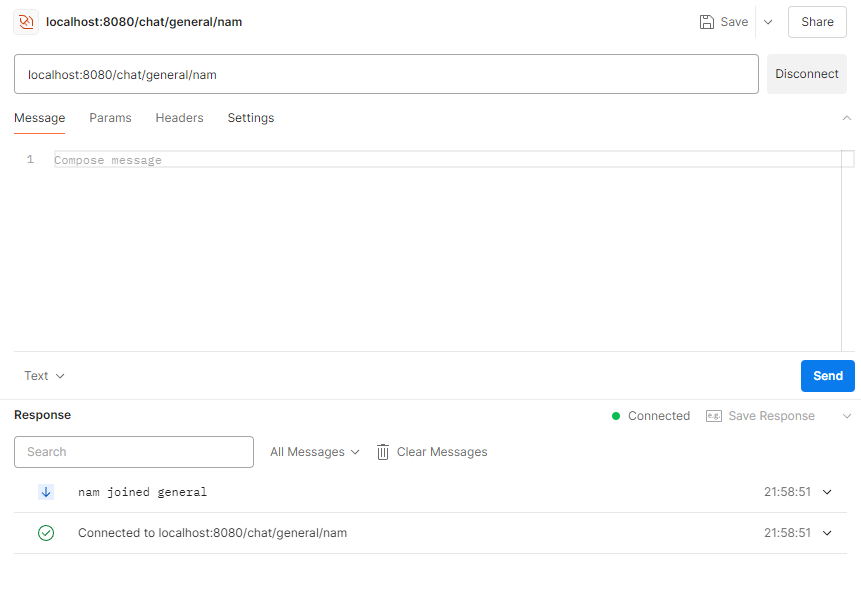
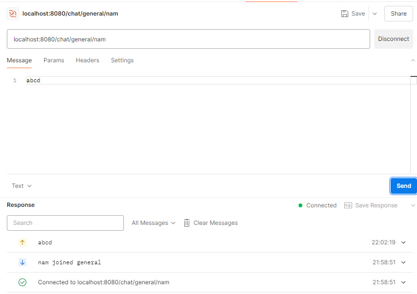
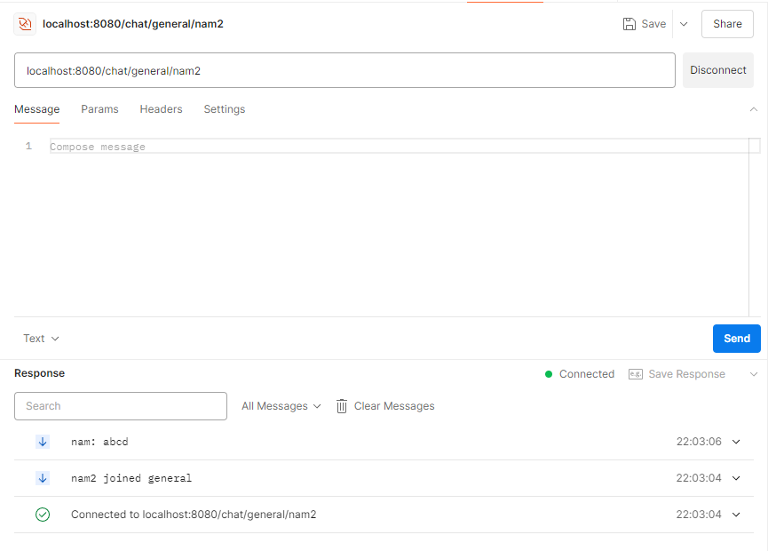
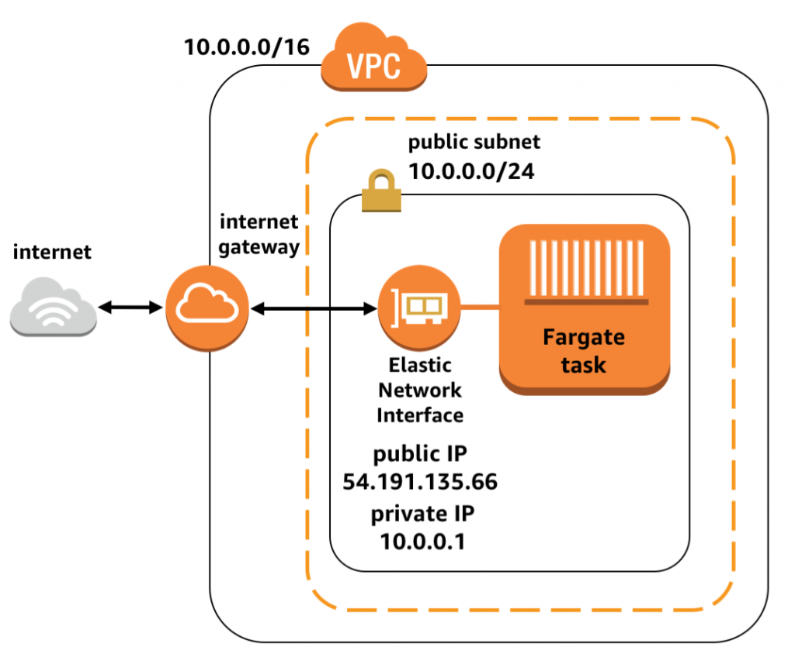

# go-chat-app

## Description

A simple realtime chat server in Go.

### Key Features

- Real-time messaging using WebSockets
- Google OAuth2 authentication
- Scalable cloud deployment with AWS and Terraform
- Github Actions workflow for CI/CD

### Dependencies

- Local run:
  - Docker and Docker Compose
  - [Client ID, Client Secret and Redirect URL for Google OAuth2](https://developers.google.com/identity/protocols/oauth2)
  - Go
  - pip + venv for pre-commit (optional)

- Cloud deployment:
  - An AWS account
  - Terraform
  - [Porkbun](https://porkbun.com/) API Key (for DNS configuration)
  - [dotenv-vault](https://www.dotenv.org/) account

### Installing

- Clone the project

```sh
git clone https://github.com/tuannamnguyen/go-chat-app
cd ./go-chat-app
```

- Add environment variables to `example.env` file and copy the values to `./cmd/api/.env`

### Executing program locally

- Start Docker Compose

```docker
docker compose up
```

- Open Postman (or any equivalent tool) and create a new Websocket connection to `localhost:8080/chat/{chat_room}/{user_name}`


- Create a new message


- See incoming messages


### Apply Terraform configuration

- Run the following command:

```terraform
terraform apply -auto-approve -input=false
       -var image_tag=(tag of the image)
       -var dotenv_key=(dotenv_key value for desired environment)
       -var porkbun_api_key=(porkbun api key)
       -var porkbun_secret_api_key=(porkbun secret api key)
```

### AWS Deployment Architecture

- Note: There is also an Application Load Balancer standing between the Internet Gateway and the subnet not depicted in this image.
